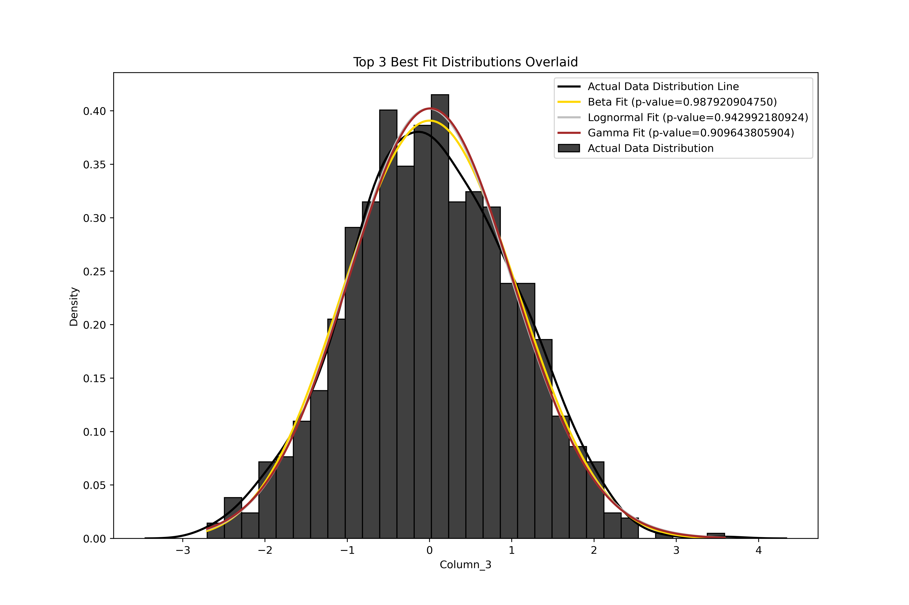
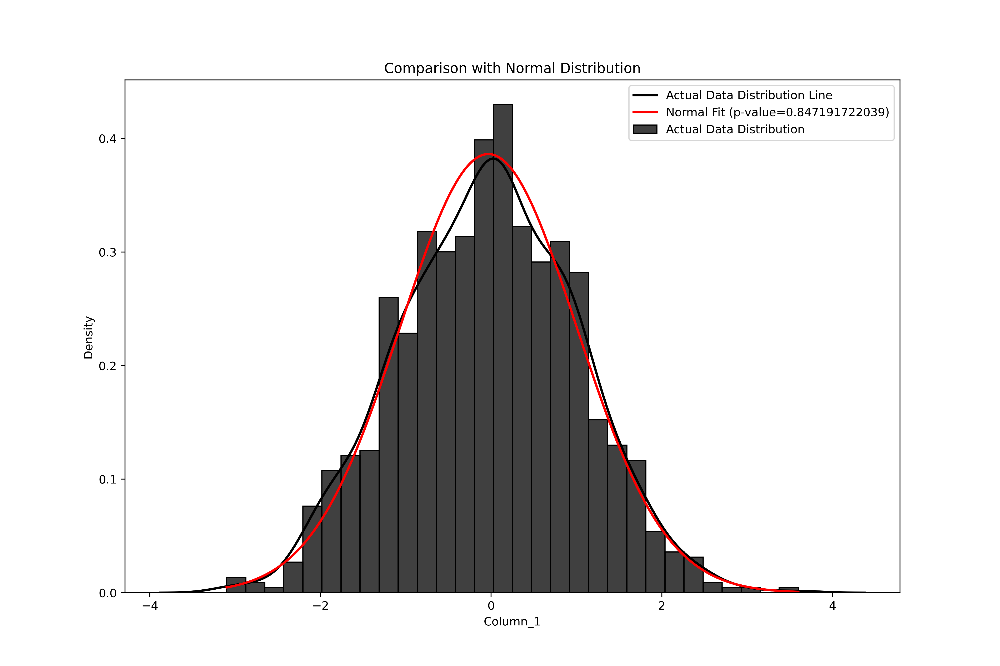

# Data Distribution Fitting

This tool allows you select data and check its distribution. The tool fits the selected data against various probability distributions and identifies the best-fitting ones. Additionally, it provides a visual comparison between the actual data distribution and the fitted distributions, including the normal distribution.

## Features

- **Upload CSV Files:** Easily upload your dataset in CSV format.
- **Select Target Column:** Choose the numeric column you want to analyze from your dataset.
- **Distribution Fitting:** The tool tests the data against a variety of distributions, including Normal, Exponential, Lognormal, and many more.
- **Top 3 Fits:** Identifies the top 3 distributions that best fit your data and displays them with their corresponding p-values.
- **Comparison with Normal Distribution:** Provides a detailed comparison between the data's distribution and the normal distribution.
- **Visualizations:** Generates clear and detailed plots showing the actual data distribution overlaid with the fitted distribution lines.
- **Disclaimer:** Informs the user that a significant p-value (below 0.05) indicates that the distribution does not conform well to the actual data distribution.




```bash
pip install -r requirements.txt
